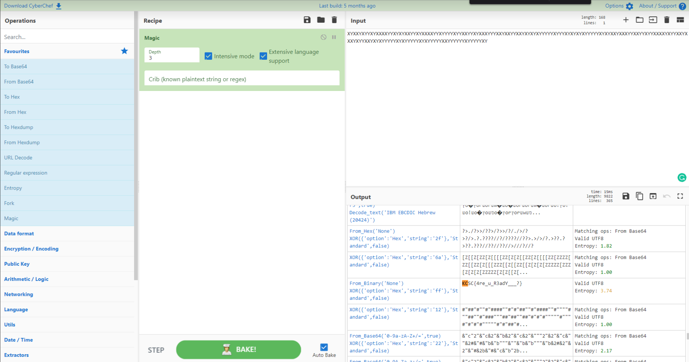
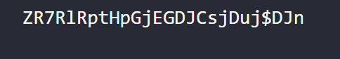
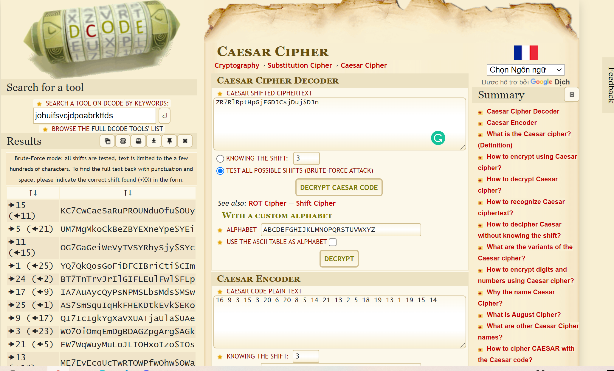
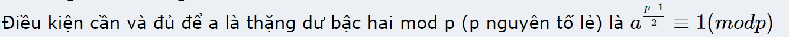

# KCSC CTF 2022 - Crypto

## 1.Warmup

warmup.txt
``` 
XYXXYXYYXYXXXXYYXYXYXXYYXYXXXXYYXYYYYXYYXXYYXYXXXYYYXXYXXYYXXYXYXYXYYYYYXYYYXYXYXYXYYYYYXYXYXXYXXXYYXXYYXYYXXXXYXYYXXYXXXYXYYXXYXYXYYYYYXYXYYYYYXYXYYYYYXXYYYYYYXYYYYYXY
```
Bài này là chuỗi các kí tự X,Y => mã nhị phân 
>Đưa lên [DCode](https://gchq.github.io/CyberChef/#recipe=Magic(3,true,true,'')&input=WFlYWFlYWVlYWVhYWFhZWVhZWFlYWFlZWFlYWFhYWVlYWVlZWVhZWVhYWVlYWVhYWFlZWVhYWVhYWVlYWFlYWVhZWFlZWVlZWFlZWVhZWFlYWVhZWVlZWVhZWFlYWFlYWFhZWVhYWVlYWVlYWFhYWVhZWVhYWVhYWFlYWVlYWFlYWVhZWVlZWVhZWFlZWVlZWFlYWVlZWVlYWFlZWVlZWVhZWVlZWVhZ) 

`flag: KCSC{4re_uR3adY__?}`
## 2.Advanced Caesar
advanced_caesar.py
```python
import string
import random

table = string.ascii_letters+string.digits+string.punctuation

len_table = len(table)


def encrypt(plaintext,key):
    ciphertext = ""
    for char in plaintext:
        char_index = table.index(char)
        char_index = (char_index+key)%len_table
        ciphertext = ciphertext+table[char_index]
    return ciphertext

key = random.randint(0,15012022)
flag = "KCSC{????????????????????}"
ciphertext = encrypt(flag,key)

f = open("advanced_caesar_output.txt","w")
print(ciphertext,file=f)
```
advanced_caesar_output.txt


Ban đầu đưa lên trên tool online [tool](https://www.dcode.fr/caesar-cipher) để dò key 
```python
ciphertext = "ZR7RlRptHpGjEGDJCsjDuj$DJn"
def decrypt(ciphertext, key):
    plaintext = ""
    for char in ciphertext:
        char_index = table.index(char)
        char_index = (char_index-key)%len_table
        plaintext = plaintext+table[char_index]
    return plaintext 
print(decrypt(ciphertext,15))
```
`flag: KCSC{Caesar_pround_of_You}`


## 3.RSA baka
RSA_baka.py
```python
from Crypto.Util.number import *
p = getPrime(256)
q = getPrime(256)
N = p*q
e = 65537
#why don't encrypt word by word in rsa ?
def encrypt(m):
    arr = []
    for char in m:
        arr.append(pow(ord(char),e,N))
    return arr

flag = "KCSC{????????????}"
ciphertext = encrypt(flag)
f = open("RSA_baka_output.txt","w")
print(f"N = {N}",file=f)
print(f"e = {e}",file=f)
print(f"ciphertext = {ciphertext}",file=f)
```
out_put.txt
```
N = 10887224132998565184671212889792167391999693945789218525362414954367270673441409014921387325344338535971177549868678239683398861737372077927406255931268559
e = 65537
ciphertext = [6490383453148831791818993448967555326156406011524488283342444556015426035759283788898481214198017189839052330624465635904654671502305598200350391968359607, 6114971306814510652226742282811400638090222521432110725688758966397446941318910032628316773459153344590657355652030404276773084433432660472787242141470270, 8255895453382135243139177315155394996634115859947684841234171271344367006987590376749610310728021170713417080083764157154940776479381742677549303790871867, 6114971306814510652226742282811400638090222521432110725688758966397446941318910032628316773459153344590657355652030404276773084433432660472787242141470270, 6602197633859720657587771157089685381603279647463736462392427769595789419221836744809641076890681210330212229469859112392984609921415686976803741623714461, 2413403103993978259606073853249912236932168564522092606962260363965206845206549360121050502230510073122519269723019921011775250713125781096215517552356129, 10234290580931305426193975982170864306373191634019788474520694898790164297975489696680597308948107329978895383237422445498353087690954001043107129284082808, 7336998612016305807202568883328160445095741929564108010434042898356567235223907992499410853800121620237604543518901363400336568026032197145035086846809682, 6114971306814510652226742282811400638090222521432110725688758966397446941318910032628316773459153344590657355652030404276773084433432660472787242141470270, 2958303022499369421389255163855041595852481624503815710227882428094513247057611560837751329875032862142590414989053243468265592040758615651637411711856001, 5249461015250236017494123466707195975796572794929891529363137136092468317942817132027440508125446525676989895818408612885379492127986620311545402652523615, 6935612593707356754842735032374896819175698256183093602527162610981621701714443696456342323885087786931262075663680592876316541546396875142621074111793166, 2935264391388604858377955344531955758810135103530349998914281877849803290322247699515000382817770308687266012722494905696513633203323723939581072734109104, 5526687546529371001521004625585578041770528727075302146086576010123401756163503485005583969602327587176472910127932482214478294301439473348514563396320212, 81688865939358112907090842501804856726826851902318443303326465615374997739879230408855444202559675815925578017785277665573281646246014297396740297259710, 8255895453382135243139177315155394996634115859947684841234171271344367006987590376749610310728021170713417080083764157154940776479381742677549303790871867, 7038198964745707190068002741225996062333697108556030805460748357918047748867654039976030223685622056096737610973997377137045828927594438793109735839403274, 1183511481948457031447390450771565242216568974691535243213295795583400913901864614352243986177208688390850980208658304695828746671850626216638436059635901]
```

` Thấy ciphertext là 1 mảng gồm nhiều số => mỗi kí tự trong flag được encrypt theo RSA.`

```python
n = 10887224132998565184671212889792167391999693945789218525362414954367270673441409014921387325344338535971177549868678239683398861737372077927406255931268559
e = 65537
ciphertext = [6490383453148831791818993448967555326156406011524488283342444556015426035759283788898481214198017189839052330624465635904654671502305598200350391968359607, 6114971306814510652226742282811400638090222521432110725688758966397446941318910032628316773459153344590657355652030404276773084433432660472787242141470270, 8255895453382135243139177315155394996634115859947684841234171271344367006987590376749610310728021170713417080083764157154940776479381742677549303790871867, 6114971306814510652226742282811400638090222521432110725688758966397446941318910032628316773459153344590657355652030404276773084433432660472787242141470270, 6602197633859720657587771157089685381603279647463736462392427769595789419221836744809641076890681210330212229469859112392984609921415686976803741623714461, 2413403103993978259606073853249912236932168564522092606962260363965206845206549360121050502230510073122519269723019921011775250713125781096215517552356129, 10234290580931305426193975982170864306373191634019788474520694898790164297975489696680597308948107329978895383237422445498353087690954001043107129284082808, 7336998612016305807202568883328160445095741929564108010434042898356567235223907992499410853800121620237604543518901363400336568026032197145035086846809682, 6114971306814510652226742282811400638090222521432110725688758966397446941318910032628316773459153344590657355652030404276773084433432660472787242141470270, 2958303022499369421389255163855041595852481624503815710227882428094513247057611560837751329875032862142590414989053243468265592040758615651637411711856001, 5249461015250236017494123466707195975796572794929891529363137136092468317942817132027440508125446525676989895818408612885379492127986620311545402652523615, 6935612593707356754842735032374896819175698256183093602527162610981621701714443696456342323885087786931262075663680592876316541546396875142621074111793166, 2935264391388604858377955344531955758810135103530349998914281877849803290322247699515000382817770308687266012722494905696513633203323723939581072734109104, 5526687546529371001521004625585578041770528727075302146086576010123401756163503485005583969602327587176472910127932482214478294301439473348514563396320212, 81688865939358112907090842501804856726826851902318443303326465615374997739879230408855444202559675815925578017785277665573281646246014297396740297259710, 8255895453382135243139177315155394996634115859947684841234171271344367006987590376749610310728021170713417080083764157154940776479381742677549303790871867, 7038198964745707190068002741225996062333697108556030805460748357918047748867654039976030223685622056096737610973997377137045828927594438793109735839403274, 1183511481948457031447390450771565242216568974691535243213295795583400913901864614352243986177208688390850980208658304695828746671850626216638436059635901]

def decrypt(n,e,ciphertext):
    arr = []
    for c in ciphertext:
        for i in range(256):
            m = pow(i,e,n)
            if m == c:
                arr.append(chr(i))
    return ''.join([i for i in arr])
print(decrypt(n, e, ciphertext))
```
`flag: KCSC{D1sCr3te_RSA}`

# 4.SQuiz Game

>Decription: nc -v 45.77.39.59 3901
```
Connection to 45.77.39.59 3901 port [tcp/*] succeeded!
Welcome to SQuiz Game about Quadratic Residue
Admin ask and you will answer : YES or NO
If you pass 100 question,I will give you the flag
p = 108625196235666864385269413544134293632736156893195552300658313993182623709531
a = 107505194717515622214738852412564899547068026694508093197508429420432950717761 is a quadratic residual?
```
Trên bài có hỏi "a is a quadratic residual of p?". Điều kiện để cho a là thặng dư bậc 2 của p 
```python
from pwn import *
host="45.77.39.59"
port=3901
r = remote(host,port)
r.recvuntil(b"p = ")
p=eval(r.recvline().strip().decode())
for i in range(100):
    r.recvuntil(b"a = ")
    a=eval(r.recvuntil(b" ").strip().decode())
    r.recvuntil(b"residual? ")
    a2=pow(a,(p-1)//2,p)
    if a2==1:
        r.sendline(b"YES")
    else:
        r.sendline(b"NO")
    print(r.recvline())
print(r.recvline())
```
`flag: KCSC{---L3g3nDrE_sYmB0L---}`

